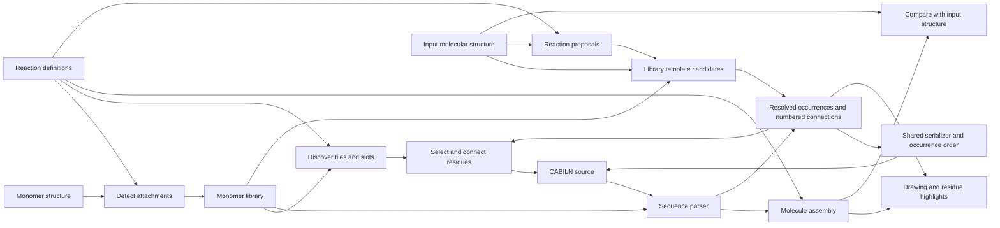

# Code layout

The builder grows from the monomer library. The chemistry package can also be
installed without the web dependencies.

The [streamlining plan](streamlining-plan.md) records the preservation contract
and migration decisions. [Validation evidence](streamlining-validation.md)
records the GUI comparisons, compatibility probes and integrated checks.

| Module | Responsibility |
| --- | --- |
| `pyPept.sequence` | Parse notation, resolve monomers, validate attachment slots and bonds |
| `pyPept.notation` | Share library-free bracket grammar, legacy normalization, slot mapping and chain emission |
| `pyPept.inputs` | Interpret formats, retain normalized source, reuse parsing/assembly within an operation and verify formatting |
| `pyPept.peptide` | Hold immutable occurrence identities, attachment sites, connections and source layout; serialize with explicit output order |
| `pyPept.source` | Carry source locations through the existing notation lowering |
| `pyPept.editor` | Edit selected occurrences and verify the requested slot-edge change |
| `pyPept.molecule` | Assemble monomers using reaction definitions |
| `pyPept.attachments` | Resolve selected or all attachment sites and supported reaction pairs using effective chemistry |
| `pyPept.leaving_groups` | Restore the same standalone structures for assembly and previews |
| `pyPept.structure` | Distinguish exact graph equality from incomplete stereo compatibility |
| `pyPept.recognition` | Compile library states and search for compatible atom ownership with explicit budgets |
| `pyPept.recognition_reactions` | Propose supported reverse reaction states with source atom provenance |
| `pyPept.recognition_notation` | Turn chosen ownership and local unknown regions into resolved occurrences and source atom assignments |
| `pyPept.smiles` | Admit only verified decompositions, preserve components, and report recognition quality |
| `pyPept.monomer_store` | Construct stored monomer records, load versioned definitions and aliases, give parsers detached copies, and perform atomic CLI/web registration |
| `pyPept.interfaces` | Monomer activation, reaction routing, and command-line tools |
| `pyPept.web.app` | Configure routes, static assets, validation responses, and server startup |
| `pyPept.web.schemas` | Validate request sizes, dimensions, slots, and notation choices |
| `pyPept.web.builder` | Expose editing and attachment inspection through HTTP |
| `pyPept.web.conversion` | Expose format conversion through HTTP |
| `pyPept.web.rendering` | Render, export, and compare molecules |
| `pyPept.web.monomers` | Browse, preview, and register monomers |
| `pyPept.web.drawing` | Generate molecular depictions |
| `pyPept.web.monomer_display` | Restore leaving groups for library previews |
| `pyPept.web.notation` | Preserve historical imports of the core input/formatting functions |
| `pyPept.web.static` | HTML, CSS, JavaScript, and example sequences |

`tools/live_renderer.py` is a compatibility launcher. Old conversion imports
continue to resolve, but new library callers should import `pyPept.smiles`.

The [design decision](architecture-rework-design.md) compares a syntax-tree rewrite
with the selected shared model. The [decomposition contract](decomposition.md) describes the
recognition path. The recognizer uses the library's actual attachment slots and
the same leaving-group restoration and effective chemistry as assembly. It
does not select one backbone before accounting for the rest of the molecule.

HTTP chemistry handlers are synchronous functions. FastAPI runs them in its
thread pool, so expensive chemistry does not occupy the event loop. Render
caches have bounded entry counts, use locks, and include the library file
version in their keys. Monomer depictions use copies of cached molecules.

`CABILN_MONOMER_LIBRARY` selects an existing SDF for default library consumers.
The CLI, palette, converter, parser and assembly use that same selection.
File changes invalidate cached discovery and conversion data. New monomer names
do not require new tile components, switch statements, or editor cases.

CLI, HTTP registration and CSV export share record construction. Registration
requires complete, known slot metadata. Bulk import retains older sparse leaving
groups and declarations; an absent leaving group still means implicit hydrogen.
Unchanged CSV builds persist chemistry declarations, arbitrary numbered slots
and author columns. Explicit `rebuild=True` retains the older reactivation policy
for amino acids, including discarding leaving-group overrides. Atomic append
and bulk replacement remain distinct operations.

`Peptide` identifies each occurrence independently of its symbol or display order.
Parsed notation and imported molecular structures both produce this model.
Its serializer returns the output occurrence order directly. Formatting never
needs to search molecular isomorphisms to rediscover which occurrence moved.

`Sequence` remains the accepted parser and input to `Molecule`. Source tracking
records original occurrences, including generated pendant chains and synthetic
tokens. `PeptideDocument` edits those locations, reparses, and checks retained
identity and the exact requested change using the shared numbered connections.
An occurrence's atom index, its attachment number, and its identity are different
things, even when two attachment slots share one anchor atom.

The source layout records every explicit segment, bracket delimiter, nested arm
and crosslink marker. The renderer consumes those records. It does not recover
branches from connected components or guess all brackets from one character in
the input. Each chip selects an occurrence or an explicit group; assembly's
residue atom map determines which drawing atoms light up.
Legacy positional notation is explicitly converted in the browser before its
residue IDs become selectable.

Reaction execution carries each atom's occurrence owner from the actual reactant
order through every reaction step. The assembler does not infer reaction order
from slot numbers or assign unowned junction atoms to a neighboring residue.
The reaction table decides support. Legacy bare-atom diagnostics retain their
warnings and parser-only acceptance without vetoing registered reactions.

Input detection has explicit policies because existing callers differ: display
prefers peptide notation for ambiguous bare text; reference/import controls
prefer SMILES. Explicit BILN/HELM inputs retain their legacy slot interpretation.
The historical `Converter.get_biln()` returns CABILN, while `Converter(biln=...)`
continues to accept legacy BILN only. Internal callers carry that format fact
instead of relying on the method name.

Normalized library tables are cached by SDF and optional CSV version. Each parser
receives its own molecules, leaving-group lists and alias metadata. Raw recognition
templates keep explicit hydrogens and use the same SDF version stamp; alias-only
updates need not recompile structural patterns. Reads retry if external file
replacement changes the version during loading. Import verification assembles
without producing drawing coordinates.

Recognition retains a cheap candidate search and an admission-aware ownership
search. They share reciprocal-boundary, unknown-atom and cover-retention rules.
One active reaction proposal can reuse candidates and verification decisions
between phases; switching proposals releases them. This bounds retained state
while avoiding repeated work on the usual single-proposal partial import.
Different state accounting remains explicit because cheap search must retain
observed partial progress, while admitted search must validate terminal partitions.

Browser requests have lifetimes tied to the current input or selection. Results
from earlier edits must not replace the current drawing, comparison, or builder
selection. Node tests exercise these races with controlled delayed responses.
Chip and SVG selection share one transition. Hover previews use the same request
lifetime manager as other reads, so closing a panel also cancels its preview.

The core suite checks molecular graphs, stereochemistry, attachment slots, and
notation conversion. HTTP tests exercise rendered MOL exports, edits, request
errors, registration, and responsiveness. The distribution test uses an installed
wheel outside the source tree, so editable imports cannot hide missing resources.
The [browser suite](../tests/browser/README.md) drives actual construction and
registration with temporary libraries. The [tools index](../tools/README.md)
separates maintained entry points from retained migration and repair history.
