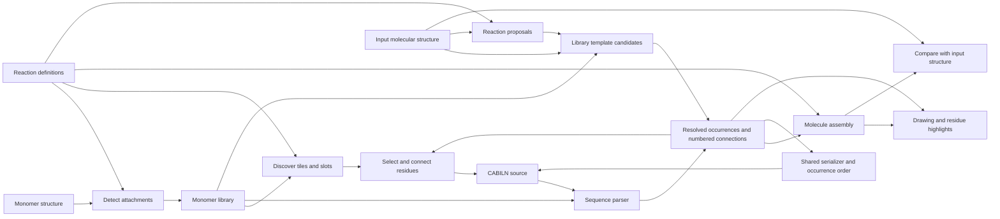

# Architecture

Monomer definitions supply registration, recognition, library tiles, attachment
choices and assembly. Each peptide contains distinct occurrences of those
definitions. Connections join numbered sites; atom ownership connects the
assembled molecule to editing and highlighting. [Domain terms](../CONTEXT.md)
defines this vocabulary.

The chemistry package can be installed without the web dependencies.

## Modules

| Module | Responsibility |
| --- | --- |
| `pyPept.sequence` | Resolve monomers and validate attachment slots and bonds; retain the public Sequence interface |
| `pyPept.notation` | Share library-free bracket grammar, legacy normalization, slot mapping and chain emission |
| `pyPept.notation_lowering` | Lower bracket scopes, inline attachments and terminal links into explicit chains while retaining source records |
| `pyPept.notation_conversion` | Preserve the historical library-free BILN/CABILN text conversions, including unsupported-text pass-through |
| `pyPept.canonical` | Label resolved graphs and write versioned canonical bracket/percent notation |
| `pyPept.synthetic` | Protect inline SMILES during parsing and construct local monomer definitions in a detached table |
| `pyPept.pdb_names` | Assign PDB residue and atom names independently of notation parsing |
| `pyPept.inputs` | Interpret formats, retain normalized source, reuse parsing/assembly within an operation and verify formatting |
| `pyPept.peptide` | Hold immutable occurrence identities, attachment sites, connections and source layout; serialize with explicit output order |
| `pyPept.source` | Carry source locations through the existing notation lowering |
| `pyPept.editor` | Edit selected occurrences and verify the requested slot-edge change |
| `pyPept.molecule` | Assemble monomers using reaction definitions |
| `pyPept.attachments` | Resolve selected or all attachment sites and supported reaction pairs using effective chemistry |
| `pyPept.leaving_groups` | Restore the same standalone structures for assembly and previews |
| `pyPept.structure` | Distinguish exact graph equality from incomplete stereo compatibility |
| `pyPept.recognition` | Compile library states and search for compatible atom ownership with explicit budgets |
| `pyPept.recognition_reactions` | Propose supported reverse reaction states with source atom provenance |
| `pyPept.recognition_notation` | Turn chosen ownership and local unknown regions into resolved occurrences and source atom assignments |
| `pyPept.smiles` | Admit only verified decompositions, preserve components, and report recognition quality |
| `pyPept.monomer_store` | Construct stored monomer records, load versioned definitions and aliases, give parsers detached copies, and perform atomic CLI/web registration |
| `pyPept.library_quality` | Fingerprint definitions and expose the explicit compatibility baseline; audit only when requested |
| `pyPept.library_snapshots` | Back up the locked SDF/alias pair and restore it while readers are stopped |
| `pyPept.interfaces` | Monomer activation, reaction routing, and command-line tools |
| `pyPept.web.app` | Configure routes, static assets, validation responses, and server startup |
| `pyPept.web.execution` | Admit bounded chemistry jobs, own child processes, cancel/replace failed workers, and record safe request diagnostics |
| `pyPept.web.readiness` | Validate installed data/assets at startup and cache the result |
| `pyPept.web.projects` | Bind saved source and chemistry evidence to library definitions and canonical conventions |
| `pyPept.web.security` | Enforce read-only, local, or authenticated administrative registration |
| `pyPept.web.schemas` | Validate request sizes, dimensions, slots, and notation choices |
| `pyPept.web.builder` | Expose editing and attachment inspection through HTTP |
| `pyPept.web.conversion` | Expose format conversion through HTTP |
| `pyPept.web.rendering` | Render, export, and compare molecules |
| `pyPept.web.monomers` | Browse, preview, and register monomers |
| `pyPept.web.drawing` | Generate molecular depictions |
| `pyPept.web.monomer_display` | Restore leaving groups for library previews |
| `pyPept.web.notation` | Preserve historical imports of the core input/formatting functions |
| `pyPept.web.static` | HTML, CSS, JavaScript, and example sequences |

## Parsing, editing and assembly

`Sequence` parses notation, resolves definitions and validates connections.
`Peptide.from_sequence` adapts it to the immutable occurrence/connection model
used by `Molecule`. Assembly labels each attachment endpoint explicitly; those
labels also identify unused sites during leaving-group restoration. Labels do
not encode occurrence or slot numbers.

`notation` parses complete recursive scopes and validates crosslink declarations
before lowering. `notation_lowering` retains original source ownership while
expanding brackets, caps and terminal links. Inline SMILES is protected during
this processing. Library-free legacy text conversions preserve unsupported
input unchanged.

`PeptideDocument` edits source locations, reparses, and checks the retained
definitions and requested connection change before assembly. Every occurrence
has its own identity, including repeated monomers, generated pendant chains
and synthetic fragments. Atom indices, occurrence identities and site numbers
serve different purposes.

Serialization returns output occurrence order and layout. The renderer uses
that layout for explicit segments, nested groups and link tabs. Assembly's atom
owners determine which atoms each tab highlights. Reaction steps preserve those
owners in the actual reactant order.

`inputs.format_source` verifies occurrences, definitions, connections and the
assembled product after formatting. Canonical export uses the shared graph
labeler in `canonical.py`; ordinary editing preserves source grouping. See
[notation](notation.md) and [canonical notation](canonical-notation.md).

Display inputs prefer peptide notation for ambiguous bare text; reference
inputs prefer SMILES. An explicit selector overrides detection. The legacy
`Converter.get_biln()` returns CABILN, while `Converter(biln=...)` accepts BILN.
Callers must retain that format distinction.

## Library and recognition

`CABILN_MONOMER_LIBRARY` selects an existing SDF for the CLI, palette, parser,
recognizer and assembler. Normalized tables are cached by SDF/CSV revision;
parsers receive detached molecule and metadata copies. Replacement during a read
causes a retry. Alias-only changes do not require structural pattern compilation.

Registration and bulk import share record construction. Registration requires
complete slot metadata and atomically appends under a lock. Bulk import retains
older sparse leaving groups and declarations; an absent leaving group means
implicit hydrogen. Explicit `rebuild=True` reactivates amino acids and discards
their leaving-group overrides. Preserve that compatibility when changing imports.

The recognizer compiles states from actual library sites, leaving groups and
effective chemistry. It searches ownership across the whole molecule and
independently verifies assembled candidates. Cheap proposal search and ownership
search have separate budgets; both share connection and unknown-region rules.
Candidates and verification decisions are reused within one active proposal.
See [recognition](decomposition.md) for result fields, ambiguity and limits.

## Browser state

| File in `web/static/` | State and behaviour |
| --- | --- |
| `document.js` | Editable source, recognition evidence, Undo/Redo and notation drafts |
| `builder.js` | Page wiring, document transitions, rendering, conversion and project controls |
| `drawing.js` | Accepted source, SVG, MOL atom order, layout and export eligibility |
| `build.js` | Selected residues/sites, connection validation, insertion, swap mappings and previews |
| `residues.js` | Atom maps, residue/group tabs, selection highlights and insertion positions |
| `library.js` | Discovery, library revisions, filtering and hover previews |
| `requests.js` | Cancellation, current-request checks, waits, calculation retries and response errors |
| `project.js` | Saved-project format and document/context validation helpers |
| `ui.js` | Viewport controls, panels, loading/retry presentation and status details |
| `tutorial.js` | Practice lessons, live prerequisites and completed-edit review |

Editing invalidates selections, comparisons and exports while retaining the last
valid drawing. Free typing has a 180 ms delay; explicit actions render
immediately. Only the current response can supply a new drawing and atom map.
Main drawing requests wait for library metadata already loading. Cancellation
also ends that wait, so superseded input cannot submit later.

Build controls derive availability from the current selection and validation.
Swap requires a reviewed product preview. Closing Build or editing the document
cancels the session. Chip and SVG selections use the same transition.

Library revisions preserve rows and focus when definitions are unchanged.
Changed definitions invalidate previews and selections even if labels match.
Search fields are prepared once per revision, and list events use shared
listeners. Newly registered monomers need no tile-specific code.

History retains each document's recognition evidence. Edits or changed bindings
invalidate it; Undo restores the saved entry. Browser recovery restores text
and context after clearing old requests. Project files also retain original
references, including uploaded MOL bytes, and verify saved definitions before
accepting a changed library.

Builder and registration share theme tokens. Panels open independently and
share Escape/focus behaviour. Drawing canvases use the same mouse, touch and
keyboard controls. Molecular atom colours are separate from interface colours.
[Drawing performance](drawing-performance.md) describes layout and notation reuse.

The optional tutorial runs in a separate `?tutorial=1` or `?tutorial=swap` tab.
It reads the Build session and accepted drawings. Build reports successful edits
even when the guide is closed; Back and Next can then review completed steps
without requiring the old selections. Unfinished steps still require valid
selections. Undo restores the source through normal editor history. Retatrutide
comes from the same cached catalog as Examples; the guide has no chemistry code.
Residue selection steps mark the target tile and its owned atoms independently
of hover highlighting. The cue clears on dismissal, step completion or source
changes; it never changes Build selection or the Highlight preference.
Practice mode bypasses browser draft loading, saving and clearing, including
page-exit saves. Closing the guide keeps that protection for the practice tab.

## HTTP and execution

HTTP chemistry handlers are synchronous functions. Local mode uses FastAPI's
thread pool. Production sends allowed operations to bounded child processes,
which enforce transport limits, deadlines and cancellation. Static assets and
health responses stay in the parent; authenticated registration uses the parent
and the library write lock. See [runtime](runtime-execution.md).

Render caches have entry and retained-byte limits, locks and library-version
keys. Monomer previews use molecule copies. Responses of at least 1,000 bytes
use gzip when requested, at compression level 4.

`tools/live_renderer.py`, historical imports from `pyPept.sequence`, and the web
notation adapter remain compatibility entry points. Internal callers use the
owning package modules.

## Verification and maintenance

[Test ownership](../tests/AGENTS.md) maps the chemistry suites. HTTP tests cover
request fields, errors, exports and persistence. Node tests control delayed and
cancelled responses. [Browser checks](../tests/browser/README.md) exercise visible
controls with temporary libraries. Distribution and release CI test installed
packages outside the source checkout.

Use [Google's review checklist](https://google.github.io/eng-practices/review/reviewer/looking-for.html)
for complexity, names and comments; [PEP 8](https://peps.python.org/pep-0008/)
with the repository's 88-column Python style; and
[Fowler's refactoring method](https://refactoring.com/) for small changes checked
against existing behaviour. [Sandi Metz's discussion of wrong abstractions](https://sandimetz.com/blog/2016/1/20/the-wrong-abstraction)
helps decide whether similar code represents the same rule.

- Give each rule and mutable state one owner.
- Share code when its meaning, inputs and lifetime agree.
- Prefer named facts, early returns and local temporary work.
- Explain chemistry and compatibility constraints in comments.
- Preserve source spelling, numbering and unsupported-input behaviour during
  refactoring. Check parser/classifier changes against a frozen baseline.
