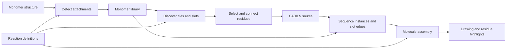

# Code layout

The builder grows from the monomer library. The chemistry package can also be
installed without the web dependencies.

| Module | Responsibility |
| --- | --- |
| `pyPept.sequence` | Parse notation, resolve monomers, validate attachment slots and bonds |
| `pyPept.source` | Carry source locations through the existing notation lowering |
| `pyPept.editor` | Edit selected occurrences and verify the requested slot-edge change |
| `pyPept.molecule` | Assemble monomers using reaction definitions |
| `pyPept.attachments` | Inspect attachment sites using assembly's chemistry detection |
| `pyPept.leaving_groups` | Restore the same standalone structures for assembly and previews |
| `pyPept.structure` | Distinguish exact graph equality from incomplete stereo compatibility |
| `pyPept.smiles` | Recognize a molecule and emit verified CABILN |
| `pyPept.monomer_store` | Select the shared library, cache records, and perform atomic CLI/web registration |
| `pyPept.interfaces` | Monomer activation, reaction routing, and command-line tools |
| `pyPept.web.app` | Configure routes, static assets, validation responses, and server startup |
| `pyPept.web.schemas` | Validate request sizes, dimensions, slots, and notation choices |
| `pyPept.web.builder` | Expose editing and attachment inspection through HTTP |
| `pyPept.web.conversion` | Expose format conversion through HTTP |
| `pyPept.web.rendering` | Render, export, and compare molecules |
| `pyPept.web.monomers` | Browse, preview, and register monomers |
| `pyPept.web.drawing` | Generate molecular depictions |
| `pyPept.web.monomer_display` | Restore leaving groups for library previews |
| `pyPept.web.notation` | Split notation and rename crosslinks without changing connections |
| `pyPept.web.static` | HTML, CSS, JavaScript, and example sequences |

`tools/live_renderer.py` is a compatibility launcher. Old conversion imports
continue to resolve, but new library callers should import `pyPept.smiles`.
Tests that patch private conversion helpers must patch their defining module.

HTTP chemistry handlers are synchronous functions. FastAPI runs them in its
thread pool, so expensive chemistry does not occupy the event loop. Render
caches have bounded entry counts, use locks, and include the library file
version in their keys. Monomer depictions use copies of cached molecules.

`CABILN_MONOMER_LIBRARY` selects an existing SDF for default library consumers.
The CLI, palette, converter, parser and assembly use that same selection.
File changes invalidate cached discovery and conversion data. New monomer names
do not require new tile components, switch statements, or editor cases.

`Sequence` remains the derived assembly model. Optional source tracking records
which original occurrence produced each monomer, including generated pendant
chains and synthetic tokens. `PeptideDocument` edits those locations, reparses,
and checks retained monomer identity and the exact requested slot-edge change.
The source remains authoritative for protected brackets, nesting, and order.
Legacy positional notation is explicitly converted in the browser before its
residue IDs become selectable.

Browser requests have lifetimes tied to the current input or selection. Results
from earlier edits must not replace the current drawing, comparison, or builder
selection. Node tests exercise these races with controlled delayed responses.

The core suite checks molecular graphs, stereochemistry, attachment slots, and
notation conversion. HTTP tests exercise rendered MOL exports, edits, request
errors, registration, and responsiveness. The distribution test uses an installed
wheel outside the source tree, so editable imports cannot hide missing resources.
