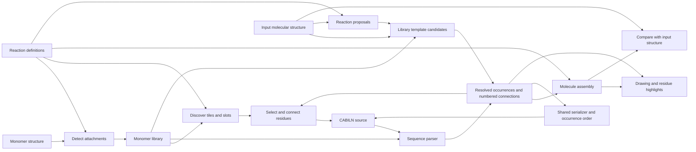

# Architecture

Monomer definitions supply registration, recognition, library tiles, attachment
choices and assembly. Each peptide contains distinct occurrences of those
definitions. Connections join numbered sites; atom ownership connects the
assembled molecule to editing and highlighting. [Domain terms](../CONTEXT.md)
defines this vocabulary.

The chemistry package can be installed without the web dependencies.

## Modules

| Module | Responsibility |
| --- | --- |
| `pyPept.sequence` | Resolve monomers and validate attachment slots and bonds; retain the public Sequence interface |
| `pyPept.notation` | Share library-free bracket grammar, legacy normalization, slot mapping and chain emission |
| `pyPept.notation_lowering` | Lower bracket scopes, inline attachments and terminal links into explicit chains while retaining source records |
| `pyPept.notation_conversion` | Preserve the historical library-free BILN/CABILN text conversions, including unsupported-text pass-through |
| `pyPept.canonical` | Label resolved graphs and write versioned canonical bracket/percent notation |
| `pyPept.synthetic` | Protect inline SMILES during parsing and construct local monomer definitions in a detached table |
| `pyPept.pdb_names` | Assign PDB residue and atom names independently of notation parsing |
| `pyPept.inputs` | Interpret formats, retain normalized source, reuse parsing/assembly within an operation and verify formatting |
| `pyPept.peptide` | Hold immutable occurrence identities, attachment sites, connections and source layout; serialize with explicit output order |
| `pyPept.source` | Carry source locations through the existing notation lowering |
| `pyPept.editor` | Edit selected occurrences and verify the requested slot-edge change |
| `pyPept.molecule` | Assemble monomers using reaction definitions |
| `pyPept.attachments` | Resolve selected or all attachment sites and supported reaction pairs using effective chemistry |
| `pyPept.site_chemistry` | Compile attachment rules, perceive chemical functionality once per graph and separate it from site roles and numbering |
| `pyPept.site_state` | Assess stable numbered sites in the current assembled structure |
| `pyPept.bond_plan` | Batch simple bond replacements verified against the reaction templates |
| `pyPept.assembly_cache` | Reuse detached assembly results within a byte and entry limit |
| `pyPept.leaving_groups` | Restore the same standalone structures for assembly and previews |
| `pyPept.structure` | Distinguish exact graph equality from incomplete stereo compatibility |
| `pyPept.recognition` | Compile library states and search for compatible atom ownership with explicit budgets |
| `pyPept.recognition_reactions` | Propose supported reverse reaction states with source atom provenance |
| `pyPept.recognition_notation` | Turn chosen ownership and local unknown regions into resolved occurrences and source atom assignments |
| `pyPept.smiles` | Admit only verified decompositions, preserve components, and report recognition quality |
| `pyPept.monomer_store` | Construct stored monomer records, load versioned definitions and aliases, give parsers detached copies, and perform atomic CLI/web registration |
| `pyPept.library_quality` | Fingerprint definitions and expose the explicit compatibility baseline; audit only when requested |
| `pyPept.library_snapshots` | Back up the locked SDF/alias pair and restore it while readers are stopped |
| `pyPept.interfaces` | Monomer activation, reaction routing, and command-line tools |
| `pyPept.web.app` | Configure routes, static assets, validation responses, and server startup |
| `pyPept.web.execution` | Admit bounded chemistry jobs, own child processes, cancel/replace failed workers, and record safe request diagnostics |
| `pyPept.web.readiness` | Validate installed data/assets at startup and cache the result |
| `pyPept.web.projects` | Bind saved source and chemistry evidence to library definitions and canonical conventions |
| `pyPept.web.security` | Enforce read-only, local, or authenticated administrative registration |
| `pyPept.web.session_library` | Allocate bounded private library snapshots, isolate requests, and expire unused copies |
| `pyPept.web.schemas` | Validate request sizes, dimensions, slots, and notation choices |
| `pyPept.web.builder` | Expose editing and attachment inspection through HTTP |
| `pyPept.web.conversion` | Expose format conversion through HTTP |
| `pyPept.web.rendering` | Render, export, and compare molecules |
| `pyPept.web.monomers` | Browse, preview, and register monomers |
| `pyPept.web.drawing` | Generate molecular depictions |
| `pyPept.web.monomer_display` | Restore leaving groups for library previews |
| `pyPept.web.notation` | Preserve historical imports of the core input/formatting functions |
| `pyPept.web.static` | HTML, CSS, JavaScript, and example sequences |

## Parsing, editing and assembly

`Sequence` parses notation, resolves definitions and validates connections.
`Peptide.from_sequence` adapts it to the immutable occurrence/connection model
used by `Molecule`. Assembly labels each attachment endpoint explicitly; those
labels also identify unused sites during leaving-group restoration. Labels do
not encode occurrence or slot numbers.

Assembly retains each surviving atom's occurrence and template atom index.
Those origins locate attachment anchors after reaction atom reordering. A copy
of the product before leaving-group restoration retains each unused numbered
port. `CurrentSites` inspects selected anchors in that graph, caching shared
anchor chemistry. SMARTS queries constrain the anchor while retaining the full
molecular context. Global matching has no implicit 1,000-match truncation.
It retains distinct anchor mappings within symmetric groups, including both
nitrogens of a urea. Targeted and global perception use the same patterns.

R numbers and occupancy remain properties of the peptide graph. Functionality
changes with the assembled structure: primary amine to secondary amine after
alkylation, or amide nitrogen after acylation. A second port on a consumed click
handle becomes unavailable. Build labels, filtering and selected-site validation
use this current chemistry; edit handlers recheck it from the submitted source.
Sulfonamide, urea, carbamate and amidine nitrogens have explicit reaction types.
They do not inherit ordinary amine coupling through a neighbour-count fallback.
Used sulfur and oxygen sites describe their product functionality. Hydrazide
and aminooxy handles lose availability when their condensation group is consumed;
separate sites on the same monomer remain available. Phosphate ports represent
independent OH substitutions, including the final esterification. Ingestion
creates one phosphate port per remaining OH, excluding ester and anionic
oxygens. Existing library site numbers remain fixed. Unreacted
oxygen charges are preserved. The classifier does not neutralize salts or model
pH; an unclassified charged nitrogen receives no neutral-amine fallback.
Library tiles still describe isolated definitions. Swap evaluates the sites
needed to preserve existing connections and validates the complete replacement
product; an occupied amide is not treated as a free amine reactant.

`bond_plan` accepts a reaction only when its templates retain every non-dummy
atom and bond and add one single bond between the two port anchors. It rejects
context-sensitive queries and stereochemical edits, and falls back to SMIRKS
execution if any connection is ineligible. Eligible joins and port removals are
batched, then the complete product is sanitized. The shared reaction definitions
remain the source of the transformation.

The assembly cache binds ordered occurrence identities, full templates,
attachment metadata, connections and rule fingerprints. It stores serialized
products, unused-port graphs and endpoint labels under a 32-MiB / 64-entry LRU
limit. Each read returns detached molecules. Preview, Apply and drawing reuse
the validated assembly without sharing mutable coordinates or atom properties.

`notation` parses complete recursive scopes and validates crosslink declarations
before lowering. `notation_lowering` retains original source ownership while
expanding brackets, caps and terminal links. Inline SMILES is protected during
this processing. Library-free legacy text conversions preserve unsupported
input unchanged.

`PeptideDocument` edits source locations, reparses, and checks the retained
definitions and requested connection change before assembly. Every occurrence
has its own identity, including repeated monomers, generated pendant chains
and synthetic fragments. Atom indices, occurrence identities and site numbers
serve different purposes.

Serialization returns output occurrence order and layout. The renderer uses
that layout for explicit segments, nested groups and link tabs. Assembly's atom
owners determine which atoms each tab highlights. Reaction steps preserve those
owners in the actual reactant order.
Assembly also retains the bonds formed by each numbered-site connection,
including multiple bonds from a cycloaddition and closures within one occurrence.
Edit results can include the verified output occurrence order and affected
connections. Build uses those records to mark its product preview; repeated
symbols and reordered source are never matched by name. Preview styling applies
to its SVG DOM and leaves the accepted drawing and exports unchanged.

`inputs.format_source` verifies occurrences, definitions, connections and the
assembled product after formatting. Canonical export uses the shared graph
labeler in `canonical.py`; ordinary editing preserves source grouping. See
[notation](notation.md) and [canonical notation](canonical-notation.md).

Display inputs prefer peptide notation for ambiguous bare text; reference
inputs prefer SMILES. An explicit selector overrides detection. The legacy
`Converter.get_biln()` returns CABILN, while `Converter(biln=...)` accepts BILN.
Callers must retain that format distinction.

## Library and recognition

`CABILN_MONOMER_LIBRARY` selects an existing SDF for the CLI, palette, parser,
recognizer and assembler. Normalized tables are cached by SDF/CSV revision;
parsers receive detached molecule and metadata copies. Replacement during a read
causes a retry. Alias-only changes do not require structural pattern compilation.

Registration and bulk import share record construction. Registration requires
complete slot metadata and atomically appends under a lock. Bulk import retains
older sparse leaving groups and declarations; an absent leaving group means
implicit hydrogen. Explicit `rebuild=True` reprocesses every existing template,
including caps and scaffolds. Stored R1/R2 anchors supply orientation; existing
handles remain mandatory while the detector adds newly supported sites. The
shared template constructor validates leaving groups, effective chemistry and
exact standalone restoration. Raw inputs without templates still require an
orientation choice when ambiguous. Review the returned errors before replacing
a library.

The recognizer compiles states from actual library sites, leaving groups and
effective chemistry. It searches ownership across the whole molecule and
independently verifies assembled candidates. Cheap proposal search and ownership
search have separate budgets; both share connection and unknown-region rules.
Candidates and verification decisions are reused within one active proposal.
See [recognition](decomposition.md) for result fields, ambiguity and limits.

### Attachment detection and registration

`pre_activate` turns a complete molecule into an explicit attachment template.
The `canonical-sites-v1` policy separates four decisions:

1. Choose the shortest supported backbone, or a supported cap orientation.
   Symmetry-equivalent choices collapse to one. Chemically distinct ties raise
   `BackboneAmbiguity` with the possible endpoint assignments.
2. Match supported sidechain handles. Explicit chemical precedence resolves
   overlapping patterns; declaration or execution order cannot number sites.
   Two competing rules with the same precedence fail rather than silently win.
   Trityl-protected nitrogens and unclassified nitrogen functionality do not
   become automatic ports. Ordinary benzylic C-H sidechain sites require
   explicit author intent; an available hydrogen alone is insufficient.
3. Assign backbone R1/R2, reserve R3 for the second backbone N hydrogen, and
   assign R4+ by canonical atom traversal. Two replaceable hydrogens on one
   sidechain nitrogen have the same functionality. Atom maps do not determine
   numbering. Canonical traversal follows the installed RDKit convention.
4. Replace each actual leaving group with its numbered dummy, then restore all
   groups and compare the complete isomeric structure with the input. This
   catches overdrawn sites and lost isotopes before registration.

The preview endpoint returns an unselected set of drawings for ambiguous input.
The browser requires an explicit choice. Python callers can pass one of
`BackboneAmbiguity.choices` as `backbone_indices`; these are atom indices in the
original parsed SMILES. `pre_activate_all` enumerates the distinct backbone
orientations, including longer beta/gamma alternatives. The CLI's `--backbone`
option selects an R1/R2 pair. Explicit CHUCKLES templates remain available for
author-defined sites that automatic detection does not cover.

The resulting template, leaving groups and chemistry become a stored definition.
New CLI, web and CSV activations record `m_activation_policy` in the SDF
(`activation_policy` in CSV). Existing stored records are never renumbered on
read. Bulk import preserves explicit templates by default. The bundled library
has been explicitly migrated in full. `monomer_migration` reprocesses authored
records, matches symmetry-equivalent handles before combining capacities, and
emits an old-to-new site mapping. The original template retains configurations
that would disappear on restoration of a prochiral carbon attachment to H.
Removing newly discovered sites must reproduce that exact authored template.
CABILN migration rewrites the resolved graph and checks its assembled structure
against both libraries. See [library migration](monomer-migration.md).

`Perception` shares compiled SMARTS and caches matches within one immutable
graph. Runtime attachment inspection separates functionality, backbone role and
the reaction dispatch type. New registration rejects contradictory declarations;
legacy metadata remains readable and is covered by the library audit.
`reactions.yaml` compiles to one route per chemistry pair. Duplicate routes,
invalid SMARTS and missing/cyclic aliases fail at startup. Named equivalent
reactions use `alias_of`. Executable targeted reactions use a bounded cache.

Project and canonical-export bindings include the chemistry-rule fingerprint as
well as the monomer, alias, reaction and cap data hashes. A project from a
different rule convention requires its original installation or a newly verified
source document. These checks establish software consistency and supported
graph transformations; they do not predict experimental reaction feasibility.

## Browser state

| File in `web/static/` | State and behaviour |
| --- | --- |
| `document.js` | Editable source, recognition evidence, Undo/Redo and notation drafts |
| `builder.js` | Page wiring, document transitions, rendering, conversion and project controls |
| `drawing.js` | Accepted source, SVG, MOL atom order, layout and export eligibility |
| `build.js` | Selected residues/sites, connection validation, insertion, swap mappings and previews |
| `residues.js` | Atom maps, residue/group tabs, selection highlights, tutorial cues and insertion positions |
| `library.js` | Discovery, library revisions, filters, favourites, recent choices and hover previews |
| `requests.js` | Cancellation, current-request checks, waits, calculation retries and response errors |
| `project.js` | Saved-project format and document/context validation helpers |
| `session-library.js` | Tab definitions, temporary server tokens, expiry recovery and staged project imports |
| `ui.js` | Viewport controls, panels, loading/retry presentation and status details |
| `tutorial.js` | Practice lessons, action cues, live prerequisites and completed-edit review |

Editing invalidates selections, comparisons and exports while retaining the last
valid drawing. Free typing has a 180 ms delay; explicit actions render
immediately. Only the current response can supply a new drawing and atom map.
Main drawing requests wait for library metadata already loading. Cancellation
also ends that wait, so superseded input cannot submit later.

Build controls derive availability from the current selection and validation.
Swap requires a reviewed product preview. Closing Build or editing the document
cancels the session. Chip and SVG selections use the same transition.

Library revisions preserve rows and focus when definitions are unchanged.
Changed definitions invalidate previews and selections even if labels match.
Search fields are prepared once per revision, and list events use shared
listeners. Newly registered monomers need no tile-specific code.

History retains each document's recognition evidence. Edits or changed bindings
invalidate it; Undo restores the saved entry. Browser recovery restores text
and context after clearing old requests. Project files also retain original
references, including uploaded MOL bytes, and verify saved definitions before
accepting a changed library.

Builder and registration share theme tokens. Panels open independently and
share Escape/focus behaviour. Drawing canvases use the same mouse, touch and
keyboard controls. Molecular atom colours are separate from interface colours.
Build places both selections before their actions in reading and keyboard order.
Technical Library metadata and preview details have explicit disclosures.
Residue, branch and library choices use native buttons. Library refreshes retain
unchanged definitions and rows; filtering uses precomputed search text and site
types. At laptop widths, opening both sidebars places
Examples below the drawings. Help uses native task disclosures. Registration
shares the charcoal surfaces and reviews sites alongside naming on wide screens.
Input validation exposes its state through both text feedback and `aria-invalid`.
[Drawing performance](drawing-performance.md) describes layout and notation reuse.

The optional tutorial runs in a separate `?tutorial=1` or `?tutorial=swap` tab.
It reads the Build session and accepted drawings. Build reports successful edits
even when the guide is closed; Back and Next can then review completed steps
without requiring the old selections. Review text retains the replacement from
the completed edit. Unfinished steps require valid selections and use
Build's pending-request state for loading instructions. Undo restores the source
through normal editor history. Retatrutide comes from the same cached catalog as
Examples; the guide has no chemistry code.
The desktop guide reserves its own column. On smaller screens, a resize observer
reserves space matching the guide's height so it can accommodate changing text.
Short action prompts accompany arrows and rings around the next control; completed
steps point to Next. Explanations expand separately, with navigation outside the
scrolling text. Cues follow scrolling and resizing, fall back to Show control when
a target is out of view, and never intercept clicks. Three brief nudges stop after
3.3 seconds; reduced motion uses steady cues. Closing or hiding the guide cancels
its cue animations. Controls inside the guide use only a ring to avoid covering text.
Residue selection steps mark the target tile and its owned atoms independently
of hover highlighting. The cue clears on dismissal, step completion or source
changes; it never changes Build selection or the Highlight preference.
Practice mode bypasses browser draft loading, saving and clearing, including
page-exit saves. Closing the guide keeps that protection for the practice tab.
Library preferences use a separate browser storage key. Practice tabs neither
read nor write it. Connection suggestions reuse the library's reaction index;
only an explicit selection starts validation, and Apply still assembles the edit.

## HTTP and execution

Temporary monomers use immutable copies of the selected SDF and its aliases.
`monomer_store.use_library` selects a snapshot through a context variable;
parsing, rendering, recognition and Build keep using the same library interface.
Existing version keys separate their caches. Requests carry an opaque library
token; only the parent resolves it to a path passed through the private worker
transport. Submitted headers and bodies cannot select a filesystem path.

`POST /session_library` validates a complete set of tab definitions in the
chemistry worker before publishing its snapshot. The shared library is never
written. Names cannot shadow existing definitions or aliases; identical installed
definitions permit project reuse. Each app keeps at most 32 snapshots and expires
idle copies after an hour. Active requests retain their copies. A tab recreates
an expired copy from session storage, including after a deployment. Normal
calculations send only the token. Definitions travel once per library revision.

Saved projects embed the tab definitions. Opening first stages a merged library,
then validates the project against that snapshot. The browser commits both only
after validation, preserving the current document and library on failure.
Temporary drafts and definitions use session storage; an explicit project
download makes them durable. The local installer remains a separate guarded
operation that writes the selected SDF atomically.

HTTP chemistry handlers are synchronous functions. Local mode uses FastAPI's
thread pool. Production sends allowed operations to bounded child processes,
which enforce transport limits, deadlines and cancellation. Static assets and
health responses stay in the parent; authenticated registration uses the parent
and the library write lock. See [runtime](runtime-execution.md).
Input errors can carry a repair hint and an original source span from the parser.
The browser converts those code-point offsets to DOM selection offsets; it does
not search for a matching monomer name or infer a location from an error string.

Render caches have entry and retained-byte limits, locks and library-version
keys. Monomer previews use molecule copies. Responses of at least 1,000 bytes
use gzip when requested, at compression level 4.

`tools/live_renderer.py`, historical imports from `pyPept.sequence`, and the web
notation adapter remain compatibility entry points. Internal callers use the
owning package modules.

## Verification and maintenance

[Test ownership](../tests/AGENTS.md) maps the chemistry suites. HTTP tests cover
request fields, errors, exports and persistence. Node tests control delayed and
cancelled responses. [Browser checks](../tests/browser/README.md) exercise visible
controls with temporary libraries. Distribution and release CI test installed
packages outside the source checkout.

Use [Google's review checklist](https://google.github.io/eng-practices/review/reviewer/looking-for.html)
for complexity, names and comments; [PEP 8](https://peps.python.org/pep-0008/)
with the repository's 88-column Python style; and
[Fowler's refactoring method](https://refactoring.com/) for small changes checked
against existing behaviour. [Sandi Metz's discussion of wrong abstractions](https://sandimetz.com/blog/2016/1/20/the-wrong-abstraction)
helps decide whether similar code represents the same rule.

- Give each rule and mutable state one owner.
- Share code when its meaning, inputs and lifetime agree.
- Prefer named facts, early returns and local temporary work.
- Explain chemistry and compatibility constraints in comments.
- Preserve source spelling, numbering and unsupported-input behaviour during
  refactoring. Check parser/classifier changes against a frozen baseline.
