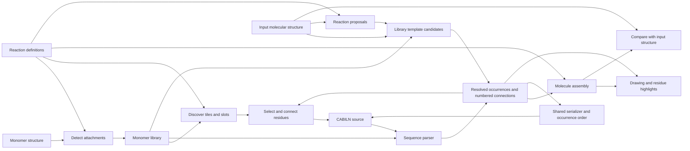

# Code layout

The builder grows from the monomer library. The chemistry package can also be
installed without the web dependencies.

The [streamlining plan](streamlining-plan.md) records the preservation contract
and migration decisions. [Validation evidence](streamlining-validation.md)
records the GUI comparisons, compatibility probes and integrated checks.

| Module | Responsibility |
| --- | --- |
| `pyPept.sequence` | Resolve monomers and validate attachment slots and bonds; retain the public Sequence interface |
| `pyPept.notation` | Share library-free bracket grammar, legacy normalization, slot mapping and chain emission |
| `pyPept.notation_lowering` | Lower bracket scopes, inline attachments and terminal links into explicit chains while retaining source records |
| `pyPept.notation_conversion` | Preserve the historical library-free BILN/CABILN text conversions, including unsupported-text pass-through |
| `pyPept.synthetic` | Protect inline SMILES during parsing and construct local monomer definitions in a detached table |
| `pyPept.pdb_names` | Assign PDB residue and atom names independently of notation parsing |
| `pyPept.inputs` | Interpret formats, retain normalized source, reuse parsing/assembly within an operation and verify formatting |
| `pyPept.peptide` | Hold immutable occurrence identities, attachment sites, connections and source layout; serialize with explicit output order |
| `pyPept.source` | Carry source locations through the existing notation lowering |
| `pyPept.editor` | Edit selected occurrences and verify the requested slot-edge change |
| `pyPept.molecule` | Assemble monomers using reaction definitions |
| `pyPept.attachments` | Resolve selected or all attachment sites and supported reaction pairs using effective chemistry |
| `pyPept.leaving_groups` | Restore the same standalone structures for assembly and previews |
| `pyPept.structure` | Distinguish exact graph equality from incomplete stereo compatibility |
| `pyPept.recognition` | Compile library states and search for compatible atom ownership with explicit budgets |
| `pyPept.recognition_reactions` | Propose supported reverse reaction states with source atom provenance |
| `pyPept.recognition_notation` | Turn chosen ownership and local unknown regions into resolved occurrences and source atom assignments |
| `pyPept.smiles` | Admit only verified decompositions, preserve components, and report recognition quality |
| `pyPept.monomer_store` | Construct stored monomer records, load versioned definitions and aliases, give parsers detached copies, and perform atomic CLI/web registration |
| `pyPept.library_quality` | Fingerprint definitions and expose the explicit compatibility baseline; audit only when requested |
| `pyPept.library_snapshots` | Back up the locked SDF/alias pair and restore it while readers are stopped |
| `pyPept.interfaces` | Monomer activation, reaction routing, and command-line tools |
| `pyPept.web.app` | Configure routes, static assets, validation responses, and server startup |
| `pyPept.web.execution` | Admit bounded chemistry jobs, own child processes, cancel/replace failed workers, and record safe request diagnostics |
| `pyPept.web.readiness` | Validate installed data/assets at startup and cache the result |
| `pyPept.web.projects` | Bind saved source and chemistry evidence to library definitions and canonical conventions |
| `pyPept.web.security` | Enforce read-only, local, or authenticated administrative registration |
| `pyPept.web.schemas` | Validate request sizes, dimensions, slots, and notation choices |
| `pyPept.web.builder` | Expose editing and attachment inspection through HTTP |
| `pyPept.web.conversion` | Expose format conversion through HTTP |
| `pyPept.web.rendering` | Render, export, and compare molecules |
| `pyPept.web.monomers` | Browse, preview, and register monomers |
| `pyPept.web.drawing` | Generate molecular depictions |
| `pyPept.web.monomer_display` | Restore leaving groups for library previews |
| `pyPept.web.notation` | Preserve historical imports of the core input/formatting functions |
| `pyPept.web.static` | HTML, CSS, JavaScript, and example sequences |

`web/static/document.js` owns editable source, evidence, bounded Undo/Redo and
notation drafts. `builder.js` passes document transitions to it and updates the
controls through one display function. Request lifetimes, storage timers and
the last successful drawing remain separate because they outlive different edits.

`residues.js` owns the accepted drawing's atom maps, residue tabs, group highlights
and backbone insertion positions. The builder passes drawing data and selection
policy through its view interface. Clearing or replacing a drawing resets these
derived facts together. Marker indexes avoid scanning every marker for each tab.

`library.js` owns discovery, library revisions, reaction filtering and hover
previews. The builder supplies current connection/swap filter facts and receives
monomer choices and library-change notifications. It does not manage the palette's
cache or DOM. `requests.js` owns request lifetimes, cancellable waits, calculation
POST encoding and response errors. Builder and registration use the same helpers;
registration writes use a single fetch without calculation retries. `ui.js`
contains shared zoom/pan and HTML escaping helpers without document state.

Imports of attachment lookup, text conversion and PDB naming functions from
`pyPept.sequence` remain supported. Internal callers use the owning modules;
attachment lookups live in `pyPept.attachments`. Synthetic definitions share
one record-construction path, both legacy hub spellings share one detachment path,
and parsing/PDB naming share selection of the monomer library resource.

`tools/live_renderer.py` is a compatibility launcher. Old conversion imports
continue to resolve, but new library callers should import `pyPept.smiles`.

The [design decision](architecture-rework-design.md) compares a syntax-tree rewrite
with the selected shared model. The [decomposition contract](decomposition.md) describes the
recognition path. The recognizer uses the library's actual attachment slots and
the same leaving-group restoration and effective chemistry as assembly. It
does not select one backbone before accounting for the rest of the molecule.

HTTP chemistry handlers stay ordinary synchronous functions. Trusted local mode
runs them in FastAPI's thread pool. Production sends the same validated HTTP
operations to a fixed pool of child processes. That seam owns admission,
payload bounds, deadlines, disconnect cancellation and worker replacement.
It has no unbounded job queue. Static assets and liveness remain in the parent;
authenticated library writes retain their existing lock/atomic replacement.
Render caches have both entry and retained-byte limits, use locks, and include
the library file version in their keys. Monomer depictions use molecule copies.

The browser keeps recognition evidence with the exact document history entry.
Editing or changing the library binding invalidates it; Undo restores the old
entry. Formatting that reorders occurrences clears import assignments when no
source correspondence is available. Project files retain original references,
including MOL bytes, and resolve definitions/connections before accepting a
changed library. Presentation never guesses scientific provenance from a name.

`CABILN_MONOMER_LIBRARY` selects an existing SDF for default library consumers.
The CLI, palette, converter, parser and assembly use that same selection.
File changes invalidate cached discovery and conversion data. New monomer names
do not require new tile components, switch statements, or editor cases.

CLI, HTTP registration and CSV export share record construction. Registration
requires complete, known slot metadata. Bulk import retains older sparse leaving
groups and declarations; an absent leaving group still means implicit hydrogen.
Unchanged CSV builds persist chemistry declarations, arbitrary numbered slots
and author columns. Explicit `rebuild=True` retains the older reactivation policy
for amino acids, including discarding leaving-group overrides. Atomic append
and bulk replacement remain distinct operations.

`Peptide` identifies each occurrence independently of its symbol or display order.
Parsed notation and imported molecular structures both produce this model.
Its serializer returns the output occurrence order directly. Formatting never
needs to search molecular isomorphisms to rediscover which occurrence moved.

`Sequence` remains the public parser and a compatible input to `Molecule`.
Assembly consumes resolved `Peptide` definitions and `Endpoint` connections;
Sequence callers adapt through `Peptide.from_sequence`. Temporary reaction labels
come from an explicit endpoint map and do not encode slot or occurrence numbers.
The same labels identify leaving groups during restoration.
Source tracking records original occurrences, including generated pendant chains
and synthetic tokens. `PeptideDocument` edits those locations, reparses, and checks
retained definitions and the exact requested change before assembling that peptide.
An occurrence's atom index, its attachment number, and its identity are different
things, even when two attachment slots share one anchor atom.

`notation` consumes complete bracket entries before legacy normalization can move
them. Parsed entries retain source slices and distinguish sequential continuation
from an arm that leaves the outer pointer unchanged. A shared declaration check
enforces inverse crosslink slots across inline, bracket, and arm spellings before
terminal inference. Library-free text adapters preserve unsupported input rather
than deleting unknown annotations. The [normalization review](notation-normalization-review.md)
records the connection rules and regression cases.

The source layout records every explicit segment, bracket delimiter, nested arm
and crosslink marker. The renderer consumes those records. It does not recover
branches from connected components or guess all brackets from one character in
the input. Each chip selects an occurrence or an explicit group; assembly's
residue atom map determines which drawing atoms light up.
Legacy positional notation is explicitly converted in the browser before its
residue IDs become selectable.

Reaction execution carries each atom's occurrence owner from the actual reactant
order through every reaction step. The assembler does not infer reaction order
from slot numbers or assign unowned junction atoms to a neighboring residue.
The reaction table decides support. Legacy bare-atom diagnostics retain their
warnings and parser-only acceptance without vetoing registered reactions.

Input detection has explicit policies because existing callers differ: display
prefers peptide notation for ambiguous bare text; reference/import controls
prefer SMILES. Explicit BILN/HELM inputs retain their legacy slot interpretation.
Main-editor requests carry the selected `input_format` through rendering and
conversion. Free-form reference requests and older callers retain autodetection.
The historical `Converter.get_biln()` returns CABILN, while `Converter(biln=...)`
continues to accept legacy BILN only. Internal callers carry that format fact
instead of relying on the method name.

Normalized library tables are cached by SDF and optional CSV version. Each parser
receives its own molecules, leaving-group lists and alias metadata. Raw recognition
templates keep explicit hydrogens and use the same SDF version stamp; alias-only
updates need not recompile structural patterns. Reads retry if external file
replacement changes the version during loading. Import verification assembles
without producing drawing coordinates.

Recognition retains a cheap candidate search and an admission-aware ownership
search. They share reciprocal-boundary, unknown-atom and cover-retention rules.
One active reaction proposal can reuse candidates and verification decisions
between phases; switching proposals releases them. This bounds retained state
while avoiding repeated work on the usual single-proposal partial import.
Different state accounting remains explicit because cheap search must retain
observed partial progress, while admitted search must validate terminal partitions.

Browser requests have lifetimes tied to the current input or selection. Results
from earlier edits must not replace the current drawing, comparison, or builder
selection. Node tests exercise these races with controlled delayed responses.
Chip and SVG selection share one transition. Hover previews use the same request
lifetime manager as other reads, so closing a panel also cancels its preview.

The browser separates the current document from the last successful drawing.
Editing invalidates selection, comparison and exports immediately while keeping
the previous drawing and viewport visible. Explicit edits render immediately;
free typing has a 180 ms debounce. Only a successful current response admits a
new atom map. Reroll preserves selections only for the same source and notation.

Document commits own bounded Undo/Redo, per-format text and conversion warnings,
and local draft saving. Recovery clears reference requests and derived chemistry
before restoring text. Beginning new work resolves an offered recovery so a
pending banner cannot suppress autosave. Existing reference-field native editing
remains separate from sequence history.

Builder and registration share local theme tokens for colour, typography,
keyboard focus, and reduced motion. Their page stylesheets own layout. Toolbar
icons are local inline SVG with visible labels; no font or UI framework download
is required. Molecular atom colours and occurrence colours remain independent
of the interface theme.

Palette responses carry an opaque library revision header. An unchanged revision
preserves rows, focus and hover previews; changed definitions invalidate them,
even if the tile labels are identical. Palette events are delegated once, and
search text and attachment types are prepared once per library revision.

The web app negotiates gzip for responses of at least 1,000 bytes, using the
existing FastAPI/Starlette middleware with compression level 4. Stereo validation
checks empty RDKit group vectors by length before iterating. Reaction ownership
restoration writes only missing owners. Both optimizations retain the molecular
verification path. The [UX and performance evidence](ux-performance-validation.md)
records their measured scope and limits.

The core suite is organized by activation, attachment reactions, restoration,
parsing, notation conversion, assembly, recognition, CLI and bundled definitions.
The shared chemistry oracle holds only reused product/atom-partition assertions.
[Test ownership](../tests/AGENTS.md) maps each responsibility to its module.
HTTP tests exercise rendered MOL exports, edits, request
errors, registration, and responsiveness. The distribution test uses an installed
wheel outside the source tree, so editable imports cannot hide missing resources.
The [browser suite](../tests/browser/README.md) drives actual construction and
registration with temporary libraries. The [tools index](../tools/README.md)
separates maintained entry points from retained migration and repair history.
